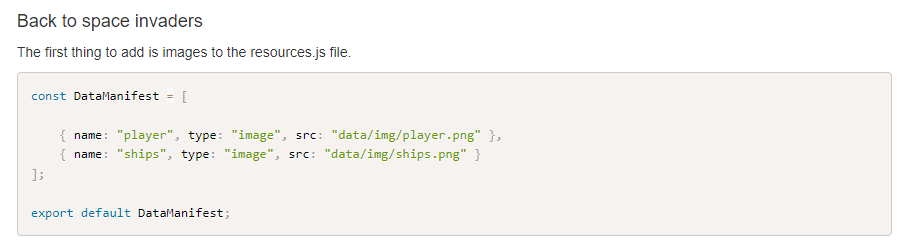
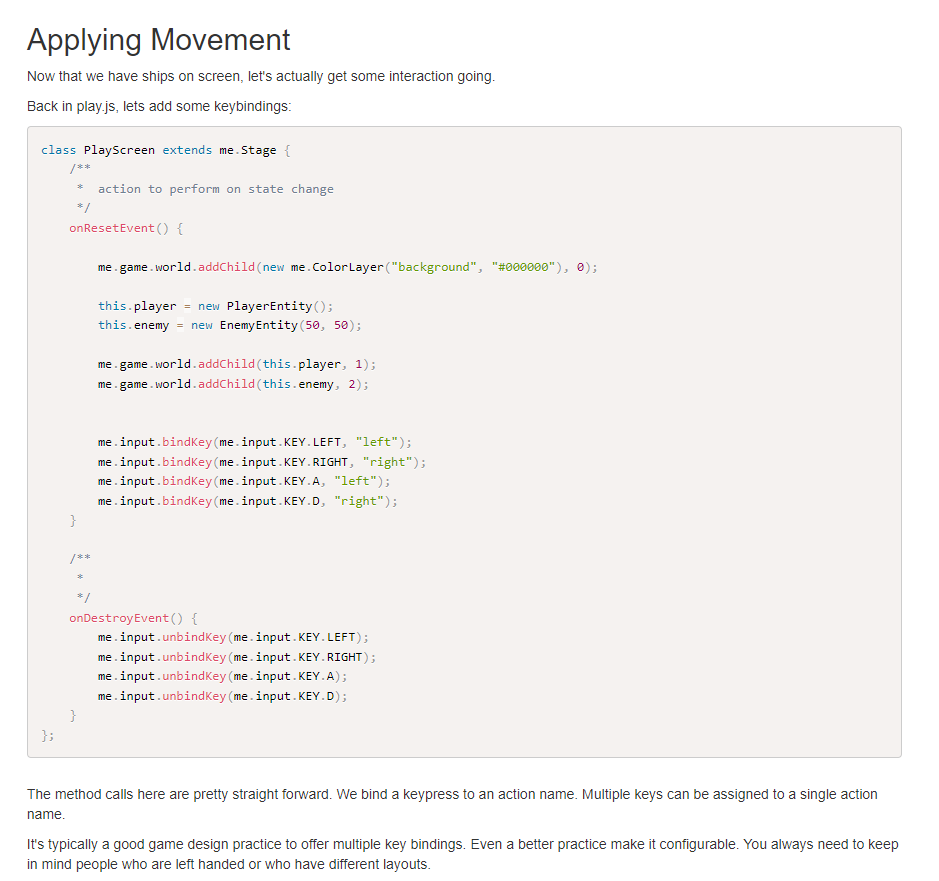

# Entry 2
Understanding my tool 12/19/22

As I mentioned in the previous blog entry, I would be working on the space invaders tutorial which I believe would help me get adjusted to the kind of stuff I would have to do to make a game. Before proceeding with the tutorial it had asked for me to install what was called a boilerplate which contained many folders and files in which I see a framework for what kind of assets and JS scripts I would need to get the game functioning. In addition to the boilerplate, for me to test it I would have to use something called `npm run build` which the npm is from NodeJS since my IDE is on the browser I couldn't use it but the boilerplate GitHub link did include a link towards a plugin and with that plugin, all I had to do is paste one line and it would install and make those commands I needed work. 


Moving on from the prerequisites and towards the actual thing, We have to start with adding our assets for now would be the images and besides uploading them to my folder I would have to reference them like this



From here I later on continued with the steps which were mostly removing or adding files and pasting in code but reading what each code block such as this 



From here I later tried adding some of the stuff from the space invaders tutorial to the platformer example in which I decided to mess with the friction as I thought it would be funny at first the friction started as this

`this.body.setFriction(0.4, 0);`

but making a keybind shown just like what is shown on that image

`me.input.bindKey(me.input.KEY.Q, "friction");`

and making a simple if statement for when it is clicked.

```js   
if (me.input.isKeyPressed("friction")){
    this.body.setFriction(1000, 0);
} 
```
We have now made a keybind that makes friction so high you can't even move. Lastly, for EDP I am currently at is researching the problem but not necessarily a problem but working towards it as I am researching the documentation on new things I can use towards my goal with MelonJS. For skills I used, The first one would be how to read as I had to read through the tutorial and documentation, and how to learn as learning can come from tinkering around with the code as I did with the friction. Hopefully, towards the winter break and beyond, I get to understand MelonJS more and get to work on more complex things.


[Previous](entry01.md) | [Next](entry03.md)

[Home](../README.md)