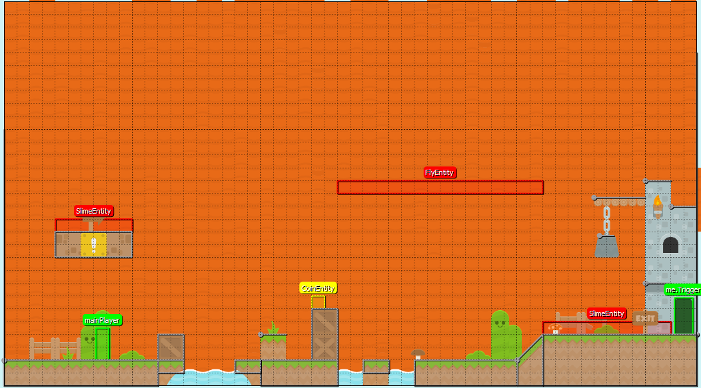
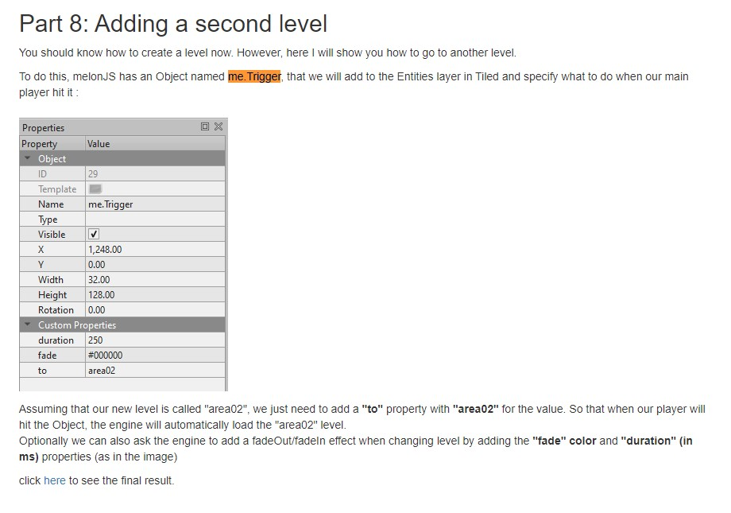
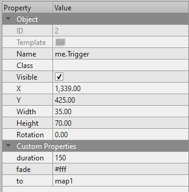

# Entry 4
##### 3/18/23

Alongside learning MelonJS I started to learn Tiled as it is a free, open-source software that allows people to create tile maps for their games it is something MelonJS works with and it is something I would need to accomplish to make different maps. In Tiled they have JSON files for the maps with them also using something called tilesets for the sprites like the ground or water used in the platformer example but I wasn't quite sure on how to use it. That was until I searched it on Google just to see and saw the original [tutorial](http://melonjs.github.io/tutorial-platformer/#part1) in which it mentioned how to use Tiled to make a level but it didn't mention much about tilesets which I was going to research on but it isn't necessarily important as it is something beyond MVP and I can use the pre-existing ones given by the tutorial for my game. However, there is the part that I saw from the example when I opened it up on tiled where it parts like `me.Trigger` as shown from the screenshot below.

As I looked through the tutorial I saw this [part](http://melonjs.github.io/tutorial-platformer/#part8) which helped as going through my original code didn't show an instance of using it besides in the JSON file of the maps themselves which I found weird but it makes sense looking at how it is done in this tutorial. Alongside with `mainPlayer` as it is where the player would spawn in which it helped me with.Besides working on Tiled I had attempted to work on something MelonJS which more specifically on making the coin make you faster for a set time as I had made some progress towards this but I believe it should be something outside of MVP as I need to make a platformer first then add special things to it like mentioned before like my own tileset to make a level look more unique than it is as it uses the platformer example. For working on the MVP I did add a new level alongside the pre-existing ones 

Over here is explaning the `me.Trigger` part which is where it changes the level

And here is how I did mine

## EDP
Currently where I am at in the Engineering Design Process is researching the problem as shown by me trying to make a level in which I had no clue on how to do with tiled until I saw that tutorial which had parts of tiled in it in which it helped me with things such as `me.Trigger` and `me.Player` but also creating a prototype as we get closer to our minimum viable product which I mentioned as me remixing the original stages and adding one but beyond that adding more original stuff such as an original tileset and additional levels.

## Skills
As for skills, I had applied how to learn for Tiled as it was something new to me and my first time but I managed to have made progress towards my new level as I got the `me.Trigger` and `me.Player` part to work which took awhile. Alongside how to learn it would also have to be the party with creativity as I am currently at the stage of making levels for my game in which I would have to apply good game design as having enemies and coins at the right spots with also giving difficulty to the player to challenge them but not make it impossible 

[Previous](entry03.md) | [Next](entry05.md)

[Home](../README.md)