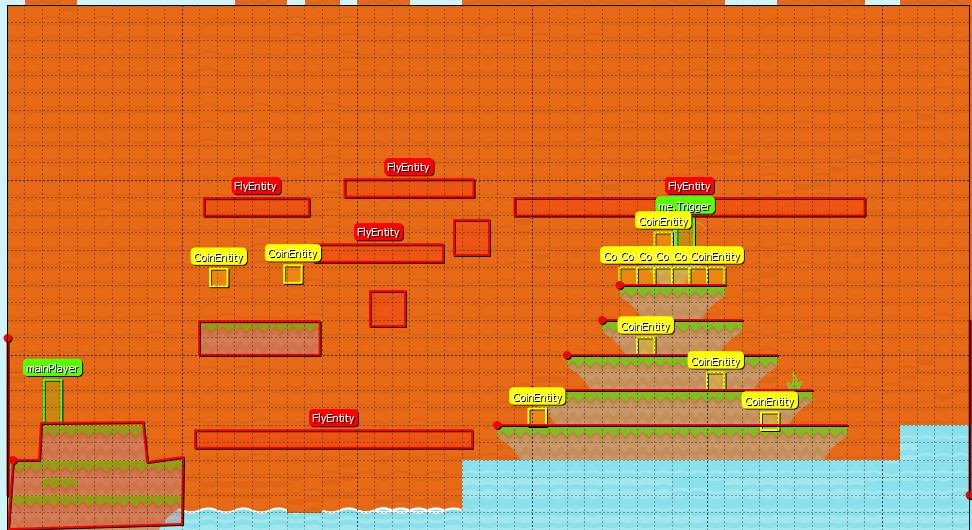

# Entry 5
## 4/18/23

For a recap for the previous entry, I had started to work on my level by learning tiled and how I can incorporate that with MelonJS as mentioned by them that it is something that I would need for my levels in which I managed to work on some aspects necessary for it to work such as the `me.Trigger` and `mainPlayer` but I had to work on the actual level design for the map. 

First I had to add collision for the levels as I didn't want the player to when he arrived to the new level that he would clip through the floor and die so I went through the example on Tiled and saw it had collision but I was intially confused on how to get it to work which was until I went through the original tutorial as I was also looking for a part for how to make good level design and saw [this.](https://github.com/melonjs/melonJS/wiki/How-to-define-world-collision-shapes-in-Tiled)

Going back on my search on how to make good level design I saw this one [article](https://www.gamedeveloper.com/design/ten-principles-of-good-level-design-part-1-) in which there was portion that mentioned a level should introduce something new or change up what was established which I wanted to do as it seemed to be more inline with getting to the MVP as making something new takes time which isn't what I had currently so what I had done was try to add more fly in order to bring more difficulty and to change up what was established before is the regular things you would expect from a platformer such as coins you can collect and enemies you should avoid so you don't die but in this new level I wanted to force the player to think about where should move and land on how they should avoid to enemies.

Here is the level I have so far atleast

## EDP
For the engineering design process the stage I am on is creating the prototype as shown from my MVP and more specifically the new level I had made for the MVP but the other stage would be testing the prototype as I had to make sure that from tiled all the things I had added such as the position at where the flys would be is at the correct position when I do play the game.

## Skills
For skills I had applied how to Google as I was searching on how to make good level design for the player in which I later found an article which gave ideas on how to a good level for I had applied one of the tips it mentioned. Another skill I had applied was attention to detail as I had to see what would be fair to the player but also difficult enough to bring a challenge and get them thinking about their move.

[Previous](entry04.md) | [Next](entry06.md)

[Home](../README.md)